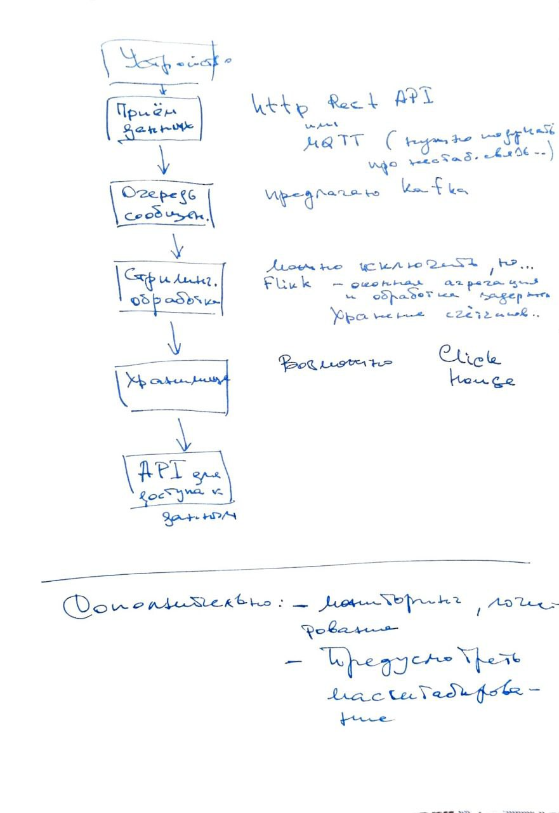

# Подсистема аналитики средней скорости транспортного потока

## Описание задачи

Имеется комплекс фотовидеофиксации (КВФВ) и таких комплексов может быть больше 1 000, в комплексе есть сущность "Событие". (проезд транспортного средства в момент времени). Кол-во событий по 1 комплексу может превышать 1 000 000 за сутки, в сущности присутствуют разные поля в том числе:

- Время наступления события
- Скорость транспортного средства

Комплекс может только фиксировать и передавать данные. Предусмотреть что комплекс стоит на федеральных трассах, где плохая связь и данные могут приходить с большой задержкой (события произошли несколько часов назад, а пришли в систему только сейчас).

**Задача** спроектировать подсистему (выбрать средства хранения и доставки данных, нарисовать общую схему работы подсистемы), которая бы считала среднюю скорость потока для выбранного КВФВ в заданный промежуток времени 5 минут, 1 час, сутки. Необходимо выбрать стек, средства хранения и передачи данных»

## Формализация задачи

- Каждый КВФВ генерирует **до 1 млн событий в сутки**.
- Всего **>1000 КВФВ** → до **1 млрд событий в сутки**.
- Данные могут приходить **с задержкой (до нескольких часов)**.
- Нужно считать **среднюю скорость** по каждому КВФВ за **5 минут, 1 час, сутки**.
- Данные приходят с **временем события**, а не временем получения.

## **Предлагаемое архитектурное решение**




###  **1. Стек технологий**

| Назначение | Технология | Обоснование |
|----------|-----------|-----------|
| **Приём данных** | Kafka или Pulsar | Высокая пропускная способность, масштабируемость (у нас сценарии простые, предлагаю остановиться наKafka)|
| **Хранение сырых данных** | S3 + Apache Iceberg / Delta Lake | Масштабируемое, поддержка time travel, late data (предлагаю остановится на Apache Iceberg - поддержка Flink, без привязки к вендору) |
| **Стриминговая обработка** | Apache Flink | Поддержка event-time, окон, обработка с задержкой (watermarks), stateful processing |
| **Хранение агрегатов** | ClickHouse / Druid | Высокая скорость агрегаций, оптимизация под аналитику (предлагаю остановиться на ClickHouse по причине точной агрегации - SUM, COUNT, AVG, DISTINCT и т.д.)|
| **API для запросов** | REST/gRPC сервис на Go/Java + кэш (Redis) | Быстрый доступ к предподсчитанным агрегатам (REST API будет проще в разработке и тетсировании, хотябы за счет того, что вебке не нужно будет работать с протобафом)|
| **Оркестрация** | Kubernetes + Helm | Масштабирование и управление |

---

## **1. Приём данных от КВФВ**

### Предлагаемое решение:
- Каждый КВФВ отправляет события (JSON) через **HTTPS REST API** или **MQTT** (если связь нестабильна, если устройство поддерживает. Тут нужно отдельно подумаьб, нужен брокер).
- API — это **stateless сервис** (предыдущие состояния не сохраняем), принимающий события и публикующий в **Kafka**.

### Формат события:
```json
{
  "kvfv_id": "KV12345",
  "timestamp": "2025-04-05T10:15:30Z",  // event time (может быть в прошлом)
  "vehicle_speed": 85.2,
  "plate_number": "A123БВ68",
  ...
}
```

### При задержке:
- Поле `timestamp` указывает **реальное время события**, а не время приёма.
- Это критично для правильной агрегации.

---

## **2. Очередь сообщений — Kafka**

### Настройки:
- Partitioning: по `kvfv_id` → один partition на КВФВ (или группу), чтобы сохранить порядок событий по времени.
- Retention: 7 дней (на случай перезапуска обработчика).

---

## **3. Стриминговая обработка — Apache Flink**

### Агрегация:
- Для каждой пары `(kvfv_id, window_start)` считаем:
  - `sum(speed)`
  - `count(events)`
- Средняя скорость = `sum(speed) / count`


---

## **4. Хранение результатов**

### 🔹 Вариант 1: **ClickHouse** (рекомендуется)

####  Преимущества:
- Колоночная БД, оптимизирована под аналитику.
- Очень быстро считает агрегаты.

#### Flink → ClickHouse:
- Flink пишет агрегаты в ClickHouse через **JDBC в Java или ClickHouse Go, соответственно в Go**.

---

## **5. API для доступа к данным**

###  Сервис:
- REST API (например, на Go или Spring Boot).
- Эндпоинт: `GET /kvfv/{id}/avg-speed?from=...&to=...&interval=5m|1h|24h`

###  Логика:
1. Запрос к ClickHouse
2. Результат кэшируется в **Redis** (мы не знаем насколько сложные запросы и как часто повторяющиеся запросы будут выполняться, поэтому пока не могу определить необходимость кеширования, не могу определить время жизни кеша)
3. Возвращается клиенту. (дашборды, мобильные приложения, веб клиент?)

---

##  **Обработка задержанных данных (late events)**

### Что делаем:
- **Watermarks** в Flink позволяют принимать события с задержкой до 3 часов.
- Если событие пришло **после watermark**, оно:
  - либо отбрасывается,
  - либо попадает в **side output** для ручной обработки (редко).
- При пересчёте: Flink обновляет состояние окна (если окно ещё не закрыто).
- Если окно уже закрыто — можно использовать **incremental aggregation** или **batch reprocessing**.

> Для максимальной точности — можно раз в сутки пересчитывать за предыдущие сутки через **batch job (Spark)**.

---

## **Масштабирование**

| Компонент | Масштабирование |
|---------|----------------|
| Kafka | Добавление брокеров и партиций |
| Flink | Параллельные задачи (по числу партиций) |
| ClickHouse | Распределённый кластер (sharding по kvfv_id) |
| API | Horizontal Pod Autoscaler (K8s) |

---

## **Дополнительно: мониторинг и логирование**

- **Prometheus + Grafana** — метрики Flink, Kafka, ClickHouse.
- **ELK** — логи.
- **Alerts** — если задержка в обработке превышает критическое время (думаю опционально).

---

## Анализ предложенного решения

- Поддержка **late-arriving data** через event-time и watermarks.
- **Масштабируемость** до миллиарда событий в день.
- **Высокая производительность** агрегации.
- **Надёжность** — данные не теряются, обработка с состоянием.
- **Гибкость** — можно добавить новые агрегаты (медианная скорость, количество нарушений и т.д.).

---

Такая система обеспечит **точную, масштабируемую и отказоустойчивую** аналитику средней скорости транспортного потока даже при плохой связи и задержках данных.


## Материалы

Pulsar vs Kafka: сравнение и мифы [https://habr.com/ru/companies/slurm/articles/548702/](https://habr.com/ru/companies/slurm/articles/548702/)

Еще 5 причин выбрать Apache Pulsar вместо Apache Kafka [https://habr.com/ru/articles/569406/](https://habr.com/ru/articles/569406/)

ClickHouse Go [https://clickhouse.com/docs/integrations/go](https://clickhouse.com/docs/integrations/go)


Apache Flink [clickhouse.com/docs/integrations/go](https://flink.apache.org/)

Проектирование высокопроизводительных кэширующих решений с использованием Redis и Memcached [habr.com/ru/companies/otus/articles/548690/](https://habr.com/ru/search/?q=%D0%9A%D1%8D%D1%88%D0%B8%D1%80%D0%BE%D0%B2%D0%B0%D0%BD%D0%B8%D0%B5+%D1%81+Redis&target_type=posts&order=relevance&hf=similar_posts_202412_B)

ELK (ElasticSearch, LogStash, Kibana) - логирование и анализ здорового человека [https://wiki.merionet.ru/articles/elk-elasticsearch-logstash-kibana-logirovanie-i-analiz-zdorovogo-cheloveka](https://wiki.merionet.ru/articles/elk-elasticsearch-logstash-kibana-logirovanie-i-analiz-zdorovogo-cheloveka)
